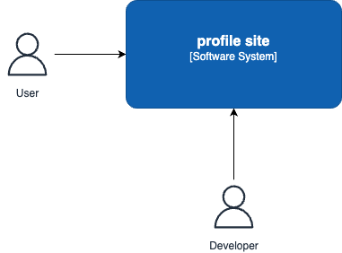
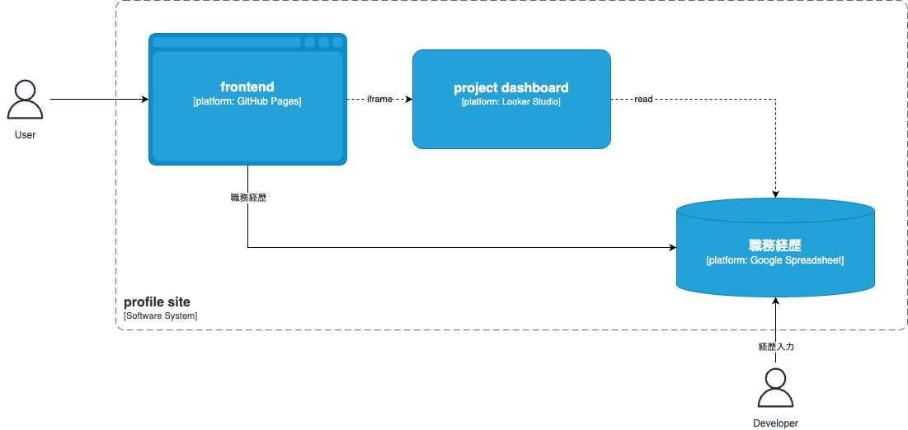
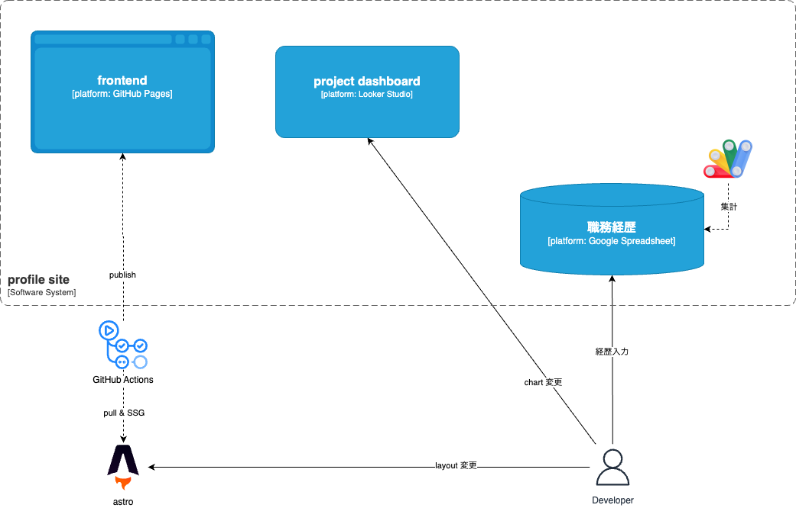

# profile

職務経歴を公開しているprofile siteです。

## アーキテクチャ


- C4 システムコンテキスト図
  - 
- C4 コンテナ図
  - 

## デプロイ

- 

| 名前 | リンク |
| --- | --- |
| profile site | <https://suwa-sh.github.io/profile> |
| project dashboard | [Looker Studio](https://lookerstudio.google.com/reporting/dadde153-a36d-4ba8-bd06-497b1e7dbd91) |
| 職務経歴 | [Spreadheet](https://docs.google.com/spreadsheets/d/1TCUUjduPYQPXYOAyAwVqX9xT7JbJcU8JebFxEfas6Fo/edit?gid=530942456#gid=530942456) |

## 開発

- frontend
  - deps

    ```sh
    npm install
    ```

  - preview

    ```sh
    npm run start
    ```

  - deploy
    - main pushed -> GitHub Actions -> GitHub Pages

  - 依存の固定 (`package.json` の `overrides`)
    - `js-yaml`: 脆弱性修正版は 4.3.1 だが、astro / @astrojs/internal-helpers が `^4.1.1` を要求する transitive 依存のため Dependabot が更新経路を作れない (`security_update_not_possible`)。`overrides` で `^4.3.1` を強制し、`package-lock.json` を 4.3.1 に固定している。
    - 変更後は `npm ci && npm run build` と `npm ls js-yaml` で解決バージョンを確認する。
    - **`overrides` は必ず範囲指定 (`^4.3.1`) で書く**。`4.3.0` のような完全固定にすると、より新しい脆弱性修正版が出ても Dependabot が更新経路を作れず `security_update_not_possible` で失敗する。
    - PR CI (`npm run check:overrides`) で完全固定を検出して落とす。ローカルでも同じコマンドで確認できる。

  - 依存更新の運用
    - `.github/dependabot.yml` で npm / github-actions を毎週更新する。transitive 依存を継続的に追従させ、`overrides` に頼らずに脆弱性を解消できる状態を保つ。
    - `overrides` は暫定対応。上流が追いついたら該当エントリを削除し、`npm ci && npm run build` で確認する。

- 職務経歴 Spreadsheet
  - 集計
    - `【職務経歴】メニュー > rebuild marts`
