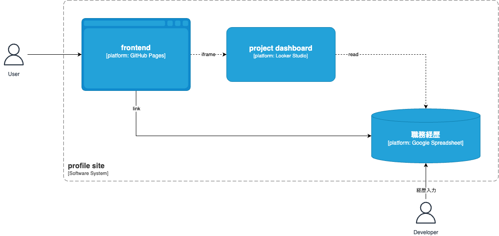

# profile

職務経歴を公開しているprofile siteです。

## アーキテクチャ


- C4 システムコンテキスト図
  - 
- C4 コンテナ図
  - 

## デプロイ

- 

| 名前 | リンク |
| --- | --- |
| profile site | <https://suwa-sh.github.io/profile> |
| project dashboard | [Looker Studio](https://lookerstudio.google.com/reporting/dadde153-a36d-4ba8-bd06-497b1e7dbd91) |
| 職務経歴 | [Spreadheet](https://docs.google.com/spreadsheets/d/1TCUUjduPYQPXYOAyAwVqX9xT7JbJcU8JebFxEfas6Fo/edit?gid=530942456#gid=530942456) |

## 開発

- frontend
  - deps

    ```sh
    npm install
    ```

  - preview

    ```sh
    npm run start
    ```

  - deploy
    - main pushed -> GitHub Actions -> GitHub Pages

- 職務経歴 Spreadsheet
  - 集計
    - `【職務経歴】メニュー > rebuild marts`
